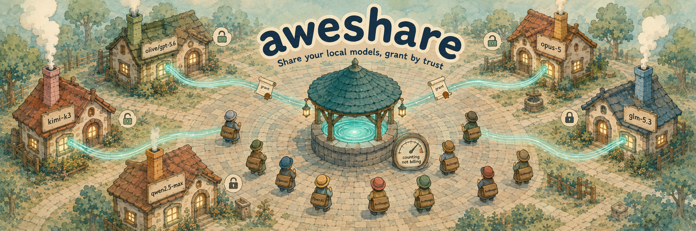

<div align="center">
  
  <h1>aweshare: Local-first AI Capability Relay <a href="https://github.com/Webioinfo01/aweskill"></a></h1>
  <p><strong>An open-source, local-first AI capability relay: share your idle local models and token subscriptions, or use what others share — a sharing economy for tokens.</strong></p>
  <p>Share local Ollama/vLLM or authorized OpenAI/Anthropic backends through a self-hosted hub, consumed with standard SDKs via <code>namespace/alias</code>.</p>
  <p><strong>Upstream API keys never leave the producer's device.</strong></p>
  <p>
    <strong>English</strong> ·
    <a href="./README_cn.md">简体中文</a> ·
    <a href="https://www.npmjs.com/package/aweshare">npm</a> ·
    <a href="https://github.com/wehuman01/aweshare">GitHub</a>
  </p>
  <p>
    <a href="https://ko-fi.com/mugpeng"></a>
  </p>
  <p>
     <a href="https://github.com/wehuman01/aweshare-source/releases"></a>
    <a href="https://github.com/wehuman01/aweshare"></a>
    <a href="https://github.com/wehuman01/aweshare/blob/main/LICENSE"></a>
    <a href="https://www.npmjs.com/package/aweshare"></a>
  </p>
  <p>
    
    
    
    
    
    
    
  </p>
</div>

> Producers run a lightweight agent on their own machine and share local Ollama/vLLM or **authorized** OpenAI/Anthropic backends. Upstream API keys live only on the producer's device and are injected by the local agent at forwarding time. Consumers point a standard OpenAI/Anthropic SDK at the hub and call models by `namespace/alias` — exactly like using any other model vendor.

```
Consumer (standard SDK, zero changes)         Producer side
┌───────────────────────┐            ┌────────────────────────────┐
│ Claude Code           │            │ aweshare producer (Node CLI)   │
│  ANTHROPIC_BASE_URL ──┼──► HTTPS ──┤  ~/.aweshare/config.toml   │
│ OpenAI SDK / Codex    │            │  ~/.aweshare/secrets.json  │
└───────────────────────┘            │   │ upstream key injection  │
           │ /v1/messages            │   ▼ (the only place it happens)
           │ /v1/chat/completions    │  Ollama / vLLM / OpenAI / Anthropic
           ▼                         │
┌─────────────────────────────┐      │
│ aweshare hub (public, 1 node)│◄───── WSS reverse tunnel (agent dials out)
│ auth / route / meter         │      no public IP, no port forwarding needed
└─────────────────────────────┘
```

- **Invite-only trust**: admission runs through one-time invite codes the operator mints; every admitted consumer may call every offering. No payments, no marketplace.
- **Namespaced aliases**: `peng/gpt-4o` is globally unique with one owner — routing is a deterministic lookup.
- v1 relays **native transparent SSE** for OpenAI↔OpenAI (chat completions and Responses), Anthropic↔Anthropic. No cross-protocol conversion, no smart routing, no web console.

## Trust boundary (read this first)

- To route and meter, **consumer prompts and model responses transit the hub in plaintext — this is not end-to-end encryption**. The hub persists no request/response content, but the hub operator can technically see it. Only use a hub instance you trust — which is why the hub is open source and self-hostable.
- Upstream API keys never leave the producer's device and are never sent to consumers. Tokens are stored twice on purpose: a **peppered SHA-256 hash** drives authentication, and the plaintext is kept so the operator can hand a lost one back (`hub list invites --token`). Invite codes work the same way — their plaintext is re-viewable with `hub list invites --reveal`. A DB leak therefore exposes every identity, so guard the data dir.
- Token revocation is **reversible suspension** (`hub admin invite revoke N` / `hub admin invite restore N`, by invite), and an invite and the producer it minted move together: revoking a redeemed code suspends that producer (and closes its tunnel), and restoring from either handle revives both. Nothing is deleted on revoke — offerings and usage history survive a suspension.

### Compliance and disclaimer

- aweshare is relay software: it cannot and does not judge whether you are allowed to share a given upstream key or subscription — that question is between you and the upstream provider. Being able to call an API yourself does not mean you may resell or re-provide it to third parties.
- Before sharing anything, read the upstream's terms (account rules, subscription and seat limits, forwarding, commercial-use clauses). Sharing a personal-subscription key — coding plans included — with third parties likely violates those terms; self-hosted open models have no such issue. **When in doubt, don't share.**
- Sharing a CLI login (`login = "codex"`) raises the stakes further: the credential is account-wide — it unlocks every subscription under that login, not one scoped key — so relaying it to third parties carries a higher risk of account suspension or termination than sharing an API key. `aweshare producer doctor` repeats this warning; the decision and its consequences sit with the producer.
- The producer bears the consequences of sharing (key revocation, account suspension or termination by the upstream). The hub operator is responsible for operating the hub lawfully and for informing consumers of the plaintext-transit boundary above.
- The software is provided "as is" under the [proprietary license](./LICENSE) — free to use and self-host, no redistribution — without warranty of any kind. The authors and contributors are not liable for how aweshare is used or for any damage arising from sharing access through it.

## Quickstart

Published as [`aweshare`](https://www.npmjs.com/package/aweshare) on npm (requires Node ≥ 22) and as a Docker image (`ghcr.io/wehuman01/aweshare`). No clone needed.

### Let an AI agent set it up

Working in Claude Code, Codex, or another coding agent? Tell it:

```text
Read https://github.com/wehuman01/aweshare/blob/main/README.ai.md and follow it to install and configure aweshare.
```

The agent installs the CLI and the skill, asks whether you are a hub operator, producer, or consumer, and does everything that is safe to automate — editing configs, minting invites, running `producer doctor`. Steps that print one-time tokens (`hub init`, `consumer join`) or start long-running services (`hub serve`, `producer start`) stay in your terminal. After setup you can ask things like "share my local Ollama model as peng/qwen2.5.7b", "why is my producer offline?", or "who used my models this week?".

### Manual setup

#### 1. Start the hub (operator, one VPS)

**npm** (simplest):

```bash
npm install -g aweshare
aweshare hub init        # data in ~/.aweshare-hub; prints the admin token — save it
aweshare hub serve       # listens on :8787 (put Caddy/nginx TLS in front)
```

The hub can also host models itself — no producer machine needed. Scaffold with `aweshare hub produce init`, add `[[backends]]`/`[[offerings]]` sections to `~/.aweshare-hub/config.produce.toml` (same format as a producer's config, alias namespace `hub/…`), put the upstream keys in `~/.aweshare-hub/secrets.json`, and run the same `aweshare hub serve` — the catalog mounts automatically and consumers dial `hub/<name>` like any offering.

**docker**:

```bash
docker run -d --name aweshare-hub --restart unless-stopped \
  -p 127.0.0.1:8787:8787 -v "$PWD/data:/data" ghcr.io/wehuman01/aweshare:latest
docker exec aweshare-hub aweshare hub init   # first run: prints the admin token, save it
```

Then bring people in. Producers join on their own — invite codes (`asi_…`, single use). Two modes:

```bash
# bound: lock the code to a specific name ("inviting that user")
aweshare hub admin invite mint --name peng [--expires-in 7d]      # → asi_..., send to the producer

# unbound: batch hand-out; the producer submits name + email at redeem (stored on the hub)
aweshare hub admin invite mint --count 10 [--expires-in 7d]

# the producer redeems it themselves (no token hand-off needed):
aweshare producer join --hub https://hub.example.com --code asi_... [--name NAME --email YOU@EXAMPLE.COM]
```

Consumers join the same way — a consumer code redeems into an `asc_` key the consumer keeps:

```bash
aweshare hub admin invite mint --role consumer --name alice [--expires-in 7d]   # → asi_..., send to the consumer

# the consumer redeems it themselves (prints the asc_ token once, with the SDK
# env vars ready to paste — save the token, it will not be shown again):
aweshare consumer join --hub https://hub.example.com --code asi_...

# no aweshare installed? one curl works too:
# curl -s -X POST https://hub.example.com/invites/v1/redeem \
#   -H 'content-type: application/json' -d '{"code":"asi_..."}'
```

Three token roles, one per party:

| Role | Who holds it | How it's used |
|---|---|---|
| `admin` | hub operator (you only) | the admin REST API (`/admin/v1/*`); CLI side: `hub admin invite mint` / `admin invite revoke\|restore` / `admin offering revoke\|restore` / `list` / `status` |
| `producer` (`asp_...`) | the agent on the producer's machine | set as `token` in `~/.aweshare/config.toml`; the agent registers its offerings with it |
| `consumer` (`asc_...`) | whoever calls the models | set in SDK env vars (`ANTHROPIC_AUTH_TOKEN` / `OPENAI_API_KEY`); it identifies the consumer for metering, limits and suspension |

The producer's `name` becomes their alias namespace (the `peng/` in `peng/gpt-4o`).

The operator owns admission: one-time invite codes for both roles, the only admission path (every identity carries its invite handle for its whole lifecycle). A redeemed consumer key may call **every** offering on the hub — if you let someone in, they can use what is shared. Guardrails: per-consumer `hub limits` (rate, concurrency, token budgets), per-offering caps (`maxConcurrentUsers`, `dailyTokens`) and `hub admin invite revoke` suspension, all enforced by the hub.

#### 2. Producer first run (in this order)

```bash
npm install -g aweshare   # ⓪ once, on the producer machine (Node ≥ 22)

# ① join with your invite code (writes ~/.aweshare/config.toml + secrets.json, 0600)
aweshare producer join --hub https://hub.example.com --code asi_...
#    or, with a producer token handed to you directly:
aweshare producer init --hub https://hub.example.com --token asp_...

# ② Edit the config (see below); put upstream keys in secrets.json — they never leave this machine

# ③ doctor: pre-flight checks, ordered to find the first failing link
aweshare producer doctor

# ④ Start (long-running; when it stops, aliases go offline and consumers get 503)
aweshare producer start            # foreground; add --background to detach it
#    detached runs are checked with 'aweshare producer doctor --status'
#    and stopped with 'aweshare producer stop'
```

#### 3. Consumer first run (in this order)

```bash
# ⓪ redeem your invite code (skip if the operator handed you an asc_ key directly)
#    prints the token once with ready-to-paste env vars — save it, it will not be shown again
aweshare consumer join --hub https://hub.example.com --code asi_...

# ① one small curl to prove the path
curl https://hub.example.com/v1/chat/completions \
  -H "Authorization: Bearer asc_..." -H "content-type: application/json" \
  -d '{"model":"peng/qwen2.5.7b","messages":[{"role":"user","content":"ping"}]}'

# ② configure your tool (below) → run one minimal task
# ③ check usage: GET /admin/v1/usage with your consumer key (you only see your own rows)
# ④ only then move to real workloads
```

## Consumer tool configuration

**Match the protocol to the tool first** — an alias speaks exactly one wire protocol and the hub never translates. Base URLs come in exactly two shapes: both OpenAI wires (`openai-chat` / `openai-responses`) point at `…/v1`, `anthropic` uses the bare hub address. The PROTOCOL column of `consumer list` / `GET /v1/catalog` shows these labels:

| PROTOCOL | Endpoint | base_url | Who can use it |
| --- | --- | --- | --- |
| `anthropic` | `/v1/messages` | `https://hub.example.com` | Claude Code, the Anthropic SDK |
| `openai-chat` | `/v1/chat/completions` | `https://hub.example.com/v1` | any OpenAI-compatible tool/SDK — opencode, zcode and other coding agents usually dial this |
| `openai-responses` | `/v1/responses` | `https://hub.example.com/v1` | Codex CLI (default `wire_api`), opencode, Cline (OpenAI Native) — not Codex-only |

A client may speak several wires (opencode speaks both OpenAI ones); pointing a chat-completions tool at an `openai-responses` alias (or vice versa) is a 404 (`unknown model alias … (no … offering under this alias)`).

**OpenAI SDK / any OpenAI-compatible tool**

```ts
const client = new OpenAI({ baseURL: 'https://hub.example.com/v1', apiKey: 'asc_...' })
await client.chat.completions.create({ model: 'peng/gpt-4o', messages: [...] })
```

**Claude Code** (the key is the `asc_` consumer key — **not** any upstream x-api-key)

```bash
export ANTHROPIC_BASE_URL=https://hub.example.com
export ANTHROPIC_API_KEY=asc_...
claude --model peng/sonnet
```

If Claude Code has a stale OAuth login it overrides env config — switch with `/login` or clean stored credentials.

**Codex** (the default Responses wire protocol works — the alias must be backed by a `responses`-protocol offering; `wire_api = "chat"` against an `openai`-protocol offering also works)

```toml
[model_providers.aweshare]
base_url = "https://hub.example.com/v1"
```

**Discovering models**: `GET /v1/models` (OpenAI SDK `client.models.list()`) returns every alias registered on the hub, with online status.

## Producer config reference (~/.aweshare/config.toml)

```toml
hubUrl = "https://hub.example.com"
token = "asp_..."

[[backends]]
id = "ollama"
protocol = "openai"                      # openai-style baseUrl includes /v1 (SDK convention)
baseUrl = "http://127.0.0.1:11434/v1"

[[backends]]
id = "anthropic-main"
protocol = "anthropic"                   # anthropic-style baseUrl excludes /v1 (agent adds it)
baseUrl = "https://api.anthropic.com"
keyRef = "anthropic-key"                 # key lives in secrets.json under this name

[[backends]]
id = "glm-responses"
protocol = "responses"                   # responses-style baseUrl includes the version path
baseUrl = "https://open.bigmodel.cn/api/v1"
keyRef = "glm-key"                       # e.g. a GLM coding-plan key (Codex-ready)

[[backends]]
id = "codex-account"
protocol = "responses"
baseUrl = "https://chatgpt.com/backend-api/codex"
login = "codex"                          # account auth instead of a key; exclusive with keyRef

[[offerings]]
alias = "peng/qwen2.5.7b"                # namespace must be your producer name
backend = "ollama"
upstreamModel = "qwen2.5:7b"             # the real backend id (full tag from `ollama list`)
maxConcurrencyPerUser = 1                # concurrent requests per consumer on this alias
# maxConcurrentUsers = 3                 # distinct concurrent consumers (hub default 3)
# dailyTokens = 1000000                  # shared tokens per Beijing day (default 1M; 0 = unlimited)
```

One offering exposes exactly one upstream model: consumers call the alias and the hub rewrites the request's model to `upstreamModel` before dispatch — they can never pick another model. To share more models, add more `[[offerings]]`.

One alias can also speak several wire protocols at once: replace `backend = "…"` with a list — `backends = ["a", "b"]` — and the block registers one offering per backend. Registrations are keyed by `alias` + `protocol`, so the listed backends must use distinct protocols (the hub rejects a duplicate); no conversion ever happens — each registration relays on its own wire. Consumers call the same alias with whichever SDK they prefer, and `producer list` / `consumer list` merge the rows into one.

**Per-offering usage caps** ride along in the same block; the optional two are enforced by the hub (defaults apply when unset, including for agents that predate them):

| Key | Default | Meaning | Enforcement |
|---|---|---|---|
| `maxConcurrencyPerUser` | 1 | concurrent requests **per consumer** on this alias | 429 `PRODUCER_MAX_CONCURRENCY` |
| `maxConcurrentUsers` | 3 | distinct consumers with a request in flight on this alias | 429 `PRODUCER_MAX_USERS` |
| `dailyTokens` | 1000000 | tokens (prompt + completion) shared across all consumers on this alias, per Beijing day (UTC+8); `0` = unlimited | 429 `QUOTA_EXCEEDED` (resets at Beijing midnight) |

`maxConcurrencyPerUser` caps each consumer's in-flight **requests**; `maxConcurrentUsers` caps in-flight **people** — a consumer firing 5 parallel requests needs `maxConcurrencyPerUser ≥ 5` for itself alone, while the total on the alias is bounded by `maxConcurrentUsers × maxConcurrencyPerUser`. Daily caps count recorded usage (see "Honest limits" below). (Renamed in v0.4.3 from `maxConcurrency`, which capped the alias's total in-flight requests.)

An exhausted daily budget can be reopened mid-day by the offering's **owner** — no restart, no re-register: `aweshare producer refresh ns/model` on the producer's machine re-anchors today's window at this moment (usage before it stops counting), `--add N` raises today's cap by N tokens until Beijing midnight, `--clear` drops both markers. For hub-hosted models the same verbs live under `aweshare hub produce refresh name` (`hub/` prefix optional). Both commands take `--all` to bare-refresh every one of their own offerings in a single run. The split is deliberate: quota expansion is the owner's call — the hub operator can restrict a producer's model (`admin offering revoke`) but never spends more of its upstream budget; grants survive re-registers and any catalog edit (they live in their own alias-keyed table, never on the offering rows) and lapse at Beijing midnight on their own. A permanent raise belongs in the config (`dailyTokens`), which hot-reloads.

Key hygiene: use dedicated, least-privilege, revocable keys with budget alerts; keep `secrets.json` at 0600 and out of git/screenshots; rotate on suspected leaks. Before sharing, check the upstream's terms: account rules, subscription limits, forwarding and commercial-use constraints.

**Account-login backends** (`login = "codex"`) authenticate with the producer machine's own `codex login` instead of a key — the fixed official upstream is `https://chatgpt.com/backend-api/codex`, responses wire. Other protocols or base URLs are rejected so the account credential cannot be sent elsewhere. How it behaves:

- The login is read from `${CODEX_HOME|~/.codex}/auth.json`, stays in producer memory only, and is re-read whenever the file changes or a request comes back 401 — so a fresh `codex login` on the producer machine is picked up without a restart. No secrets.json entry exists for it.
- The producer injects the headers the Codex CLI itself sends, forces `store: false`, and removes `max_output_tokens` emitted by some Responses SDKs (the chatgpt backend rejects it).
- If the producer reaches ChatGPT through an HTTP(S) proxy, it honors `HTTPS_PROXY`, `HTTP_PROXY`, `ALL_PROXY`, and `NO_PROXY` for this account-login upstream only. Proxy URLs are never logged; SOCKS proxies are not supported.
- Consumers must speak `/v1/responses`: Codex CLI (default `wire_api`), opencode (via `@ai-sdk/openai`), Cline (OpenAI Native provider). Chat-completions tools and Claude Code cannot use these offerings.
- Tokens are never refreshed by aweshare: when the login expires the offering degrades (2 consecutive 401s → 503 `BACKEND_DEGRADED`) and recovers on its own once you re-run `codex login` — the 30s recovery probe re-reads the file.
- Sharing a subscription login is **higher-risk than sharing an API key** — see the compliance section above: the credential is account-wide, and the producer bears suspension of the whole account.

## Consumer limits (hub-wide defaults + per-consumer overrides)

Every consumer gets the hub-wide defaults (`AWESHARE_CONSUMER_RPS` / `BURST` / `CONCURRENCY`, see Operations). On top of that, the hub admin can set **sparse per-consumer overrides** — only the keys you set take effect, everything else keeps the defaults:

```bash
aweshare hub limits alice --tpm 60000 --max-total-tokens 5000000  # set (merges into stored)
aweshare hub limits alice                                        # view current overrides
aweshare hub limits alice --clear                                # back to hub-wide defaults

# the same knobs over the admin REST API (PUT / DELETE the same path):
curl -X PUT https://hub.example.com/admin/v1/consumers/alice/limits \
  -H "Authorization: Bearer asa_... (the admin token)" -H "content-type: application/json" \
  -d '{"tpm":60000,"maxTotalTokens":5000000}'
```

| Key | Meaning | Enforcement |
|---|---|---|
| `rps` / `burst` / `maxConcurrent` | override the hub-wide rate/inflight defaults for this consumer | 429 `RATE_LIMITED` |
| `tpm` | max tokens (prompt + completion) in any sliding 60s window | 429 `RATE_LIMITED` (in-memory window, like the RPS bucket) |
| `maxTotalTokens` | lifetime token budget for this consumer | 429 `QUOTA_EXCEEDED` (sums `usage_events`) |

Honest limits: token-based caps count what upstreams report — Ollama streams report no usage, so they contribute 0. Both TPM and the lifetime budget are observed-usage thresholds, not hard reservations: one request can cross the threshold, and concurrent requests that start before earlier usage is recorded can overshoot it further. Once recorded usage has reached the threshold, new requests are rejected.

## Endpoints and errors

| Endpoint | Purpose |
|---|---|
| `POST /v1/chat/completions` · `POST /v1/messages` · `POST /v1/responses` | inference (Bearer or `x-api-key`) |
| `GET /v1/models` | every alias registered on the hub, with status |
| `GET /v1/catalog` | every offering on the hub — producer, alias, protocol, status, the per-offering caps, live in-flight occupancy (`activeUsers`/`activeRequests`) and today's used/remaining tokens (discovery view for `aweshare consumer list`) |
| `GET /healthz` | liveness |
| `GET /admin/v1/offerings` | registered offerings with live status, caps, in-flight occupancy and today's used tokens — admin sees everything, a producer token only its own slice (`aweshare producer list`) |
| `/admin/v1/*` | token/limit/usage management (admin or producer token) · usage: `GET /admin/v1/usage` (newest-first log) and `GET /admin/v1/usage/summary` (`group=consumer-alias\|consumer\|alias`, `since=30m\|12h\|7d\|all`, default 7d, `consumer`/`producer`/`alias` filters; every role sees its own slice) · consumer limit overrides: `GET`/`PUT`/`DELETE /admin/v1/consumers/{name}/limits` (admin only) |

Error semantics: `401` invalid key · `401 TOKEN_REVOKED` suspended token (ask the operator to restore it) · `403 HUB_FULL` producer capacity reached · `404` unknown alias · `400 PROTOCOL_MISMATCH` protocol/alias mismatch · `429` rate limit, TPM or producer concurrency cap (`PRODUCER_MAX_USERS` = distinct-consumer cap; `QUOTA_EXCEEDED` = lifetime or daily token budget hit) · `502` upstream/tunnel failure (upstream 4xx/5xx passes through verbatim) · `503` producer offline / backend degraded · `504` timeout. Errors carry `{error:{code,message,requestId}}`; the requestId spans both sides' logs.

Usage metering: one row per request (alias, declared upstream model, response-reported model when available, status, duration, byte counts, best-effort token counts), **zero content stored**. `aweshare hub list usage` (and `aweshare producer list usage` on a producer's machine, scoped to its own models) answers "who used how much" by default: server-side aggregation on the hub's SQLite, one row per consumer × model, **most recently used first** — with request/error counts, best-effort token totals, an explicit unknown-token count (streaming backends that report no counts) and mean duration. The window defaults to 7 days and is printed with the table (`--since 30m\|12h\|7d\|…\|all`); `--group-by consumer` rolls up to per-person totals, `--group-by alias` to per-model totals; `--sort` re-orders the rows (`consumer`, `producer` or `model`, alphabetical with newest first within; `tokens` or `requests`, busiest first — tokens keeps a person's rows together, the pre-0.6.1 default order). `--details` switches to the per-request log (`GET /admin/v1/usage`; admin sees everything, producers and consumers their own slice, rows carry the consumer/producer names).

## Command reference

Both sides at a glance — details in the sections above.

**Hub (operator)** — needs the admin token from `aweshare hub init`; for a hub on another server, run these on the server or set `AWESHARE_HUB_URL`:

| Command | Purpose |
|---|---|
| `aweshare hub init` | create data dir + admin token (printed once) |
| `aweshare hub serve [--host H] [--port N]` | run the hub — the only runner; a `config.produce.toml` in the data dir mounts automatically: its `[[backends]]`/`[[offerings]]` sections become `hub/…` offerings served in-process (keys in the data dir's secrets.json; edits hot-reload) |
| `aweshare hub produce init` | scaffold `config.produce.toml` + empty `secrets.json` in the data dir (kept if they exist); also initializes the data dir, db, pepper and admin token |
| `aweshare hub admin invite mint [--role producer\|consumer] [--name NAME] [--count N] [--expires-in D\|none]` | mint one-time invite codes (`asi_…`, printed once, expire after 7 d by default; re-view with `list invites --reveal`); `--expires-in` also bounds the lifetime of the token it mints — an expired key fails auth with 401 `TOKEN_EXPIRED` (`none` = code and identity never expire; identities minted before this change never expire); producer codes: bound (`--name`) or unbound (name + email at redeem, `--count` batches); consumer codes: always bound to one name |
| `aweshare hub admin invite revoke N` · `aweshare hub admin invite restore N` | kill an invite / undo — a redeemed code suspends the producer it minted, restore revives both |
| `aweshare hub admin offering revoke ALIAS` · `aweshare hub admin offering restore ALIAS` | the per-alias scalpel between doing nothing and revoking a whole producer: revoke one offering (every protocol row of the alias) — new requests get 503 `OFFERING_BLOCKED`, `list offerings` shows `blocked`, the producer's other offerings keep serving. Manual revokes survive re-registers; auto revokes (model mismatch, see `autoBlockModelMismatch`) clear once the producer re-declares a different `upstreamModel` |
| `aweshare hub list [invites\|producers\|consumers\|offerings\|usage]` | read hub state, one table per noun (default: invites) |
| `aweshare hub list invites [--reveal] [--token] [--json]` | the invite ledger: every code, the identity it minted and its lifecycle (pending/used/suspended/revoked/expired; a redeemed code shows `expired` once its identity's expiry passes); `--reveal` re-shows the codes, `--token` the minted tokens with last seen |
| `aweshare hub list producers [--json]` · `aweshare hub list consumers [--json]` | the rosters: name, status (active/suspended/built-in), online state (producers), last seen, created |
| `aweshare hub list offerings [--json]` | the catalog: offerings counted per deduplicated alias (several protocols → one verdict, the worst), one row per alias — the same columns as `consumer list` and `producer list`, worst status first — with observed model, caps, live occupancy (`IN USE n/max`) and today's remaining daily tokens |
| `aweshare hub status` | the live dashboard: capacity (producer slots, consumers, offering counts), a last-5m requests/ok-rate/errors line from the usage summary (hub-admission 429s are not metered), admission-rejection pressure (top throttled alias/consumer) and the effective consumer defaults |
| `aweshare hub limits NAME [--rps N] [--burst N] [--max-concurrent N] [--tpm N] [--max-total-tokens N] [--clear] [--json]` | show, merge or clear one consumer's limit overrides (unset keys keep the hub-wide defaults) |
| `aweshare hub list usage [--details] [--consumer NAME] [--producer NAME] [--alias ns/model] [--group-by consumer-alias\|consumer\|alias] [--since 7d\|all] [--sort time\|consumer\|producer\|model\|tokens\|requests] [--limit N] [--json]` | who used how much (default): aggregate per consumer × model, most recently used first — requests, errors, rate, best-effort token totals, unknown-token count, mean duration; window defaults to 7d and is printed with the table; `--sort` re-orders (consumer/producer/model alphabetical, tokens/requests busiest first) · `--details`: per-request log, newest first, zero content stored, each row naming its consumer |
| `aweshare hub produce refresh NAME [--add N] [--clear] [--json]` · `aweshare hub produce refresh --all [--json]` | reopen a hub-hosted model's daily token budget mid-day (`hub/` prefix optional): bare call re-anchors today's window at this moment, `--add N` raises today's cap by N tokens until Beijing midnight, `--clear` drops both markers. Hub-hosted (`hub/…`) offerings only — a producer's models are its own to refresh. `--all` bare-refreshes every `hub/…` offering with a daily cap in one run (unlimited ones are reported and skipped; one failure does not stop the rest) |

Token issuance runs through invites (both roles). `admin`, `limits` and `list usage` are thin wrappers over the admin REST API (`/admin/v1/*`, see Endpoints and errors) — curl works too.

Every `list` table and `status` print aligned columns by default; append `--json` (where documented) for the raw API rows.

**Producer** — runs on the producer's machine (the one with the backends):

| Command | Purpose |
|---|---|
| `aweshare producer init [--hub URL] [--token asp_…]` | write config templates into `~/.aweshare` |
| `aweshare producer join --hub URL --code asi_… [--name NAME --email YOU@EXAMPLE.COM]` | redeem an invite code into a producer token and write it into the config (`--name`/`--email` for unbound codes; probes the hub first — plain HTTP outside the LAN needs `--allow-http`) |
| `aweshare producer config path` · `config show` · `config edit` | locate / inspect (secrets redacted) / edit the config |
| `aweshare producer doctor [--status]` | diagnose end to end: background instance, config, backend probes, hub (including how many of your offerings are registered), recent log (`--status` skips the network probes for an instant answer) |
| `aweshare producer list [offerings] [--json] [--all]` | what this producer has registered on the hub — alias, protocol, live status, caps, live occupancy (`IN USE`, distinct consumers in flight right now), today's token use — plus the local background instance state and drift against config.toml (hubUrl/token come from config.toml); `--all`: every producer's registrations, the discovery view |
| `aweshare producer list usage [--details] [--consumer NAME] [--alias ns/model] [--group-by consumer-alias\|consumer\|alias] [--since 7d\|all] [--sort time\|consumer\|model\|tokens\|requests] [--limit N] [--json]` | who used this producer's models (the producer token scopes the hub's metering to its own slice): aggregate per consumer × model by default, most recently used first (`--sort` re-orders), window defaults to 7d · `--details`: per-request log, newest first, each row naming its consumer |
| `aweshare producer status` | the live one-glance summary: local process, config counts, registered-offering health rollup and drift — the full table is `list offerings` |
| `aweshare producer start [--background]` | connect and relay (long-running; `--background` detaches it — logs to `~/.aweshare/producer.log`, pid to `producer.pid`) |
| `aweshare producer reload` | signal the background producer (SIGHUP) to re-read `config.toml` + `secrets.json` and re-register its offerings on the open tunnel — no disconnect; a broken config keeps the previous values |
| `aweshare producer refresh ALIAS [--add N] [--clear] [--json]` · `aweshare producer refresh --all [--json]` | reopen one of this producer's offerings mid-day, hub-side and effective at once (works even while the agent is stopped): bare call re-anchors today's window at this moment — usage before it stops counting; `--add N` raises today's cap by N tokens until Beijing midnight (replaces an earlier bonus); `--clear` drops both markers. Own offerings only; a permanent raise belongs in `dailyTokens`. `--all` bare-refreshes every registered offering with a daily cap in one run (unlimited ones are reported and skipped; one failure does not stop the rest) |
| `aweshare producer stop` | stop the background producer (SIGTERM, SIGKILL after 10s) and clean up its pidfile |

**Consumer** — two commands, on the consumer's machine; day-to-day they point a standard SDK at the hub (see Consumer tool configuration):

| Command | Purpose |
|---|---|
| `aweshare consumer join --hub URL --code asi_… [--allow-http]` | redeem a consumer invite into an `asc_` token — printed once with ready-to-paste SDK env vars (save it; the operator can re-view it with `hub list invites --token`) |
| `aweshare consumer list --hub URL --token asc_… [--all] [--json]` | discovery view of the hub: online offerings by default (degraded stay listed; `--all` includes offline) — every producer, alias, protocol, status, the per-offering caps, live occupancy (`IN USE n/max` — distinct consumers with a request in flight right now; an alias at `max/max` admits no new consumer until one settles) and remaining daily tokens |
| `aweshare consumer ping --hub URL --token asc_… [--alias a,b]` | end-to-end check: one minimal real model request per online offering row (SDK-shaped, `max_tokens:1`) reporting status, round-trip latency and the served model per alias/protocol — a FAIL passes the hub/upstream error through verbatim. Real calls consume quota, so scope with `--alias`; exit 1 on any failure |

CLI maintenance: `aweshare self-update [--check]` updates the npm-installed CLI (`--check` only compares versions).

## Operations

No always-on box to share from, or looking for models others share? The project's developer runs a community hub at **https://aweshare.wehuman.top** (invite-based — request a code at peng@wehuman.top); [docs/community-hub/](./docs/community-hub/README.md) is a step-by-step guide for connecting as a producer or consumer (中文版).

The hub reads `config.toml` from its data dir (`~/.aweshare-hub/config.toml`; Docker: `/data/config.toml`). `aweshare hub init` writes the template with every key commented out — uncomment to override a default. Keys use the same names as below, camelCase (`consumerRps`, `headTimeoutMs`, …). Precedence: `serve` flags (`--host`/`--port`) > env vars > config.toml > defaults. A broken file (invalid TOML, unknown key, non-positive value) fails fast at startup with the key named; `AWESHARE_HUB_DATA_DIR` itself stays env-only (it locates the file).

**Hot reload:** every tunable in the table except host/port applies live on `SIGHUP` (`kill -HUP <pid>`; Docker: `docker kill -s HUP aweshare-hub`) — the new file is validated first, and a broken edit is logged while the previous values keep serving. Env vars are fixed at process start, so keys pinned by `AWESHARE_*` ignore the reloaded file (same precedence as startup); host/port need a restart. Producer-side offerings and caps reload via `aweshare producer reload`.

**Hub-hosted models (`hub produce`):** `config.produce.toml` carries `[[backends]]` and `[[offerings]]` sections (producer format; alias namespace `hub/…` — bare names are auto-prefixed) with upstream keys in `secrets.json` next to it (chmod 600). `config.toml` remains exclusively for Hub runtime settings. Those offerings appear in the catalog under producer `hub` and are served by the hub process directly — no tunnel, and they never count against `AWESHARE_MAX_PRODUCERS`. Caps (`maxConcurrencyPerUser`, `maxConcurrentUsers`, `dailyTokens`), usage metering and consumer limits apply exactly as for remote producers. The built-in `hub` producer is not an identity (no token, no invite, cannot be revoked); it appears in the `hub list producers` roster — status `built-in` — only while it carries offerings. An `enabled = true|false` key at the top of the file is the catalog's master switch: `false` unloads every `hub/…` model within the hot-reload window (the definitions stay; flip back to bring them all back) — the produce-side counterpart of revoking a remote producer's invite. A non-boolean value fails loudly instead of silently serving or unloading. Catalog and key edits hot-reload like the tunables; a broken catalog keeps the previous one and is logged.

| Env var | Default | Purpose |
|---|---|---|
| `AWESHARE_HUB_DATA_DIR` | `~/.aweshare-hub` | data dir (SQLite/pepper/admin token/config.toml; volume-mount = backup) |
| `AWESHARE_HUB_PORT` / `HOST` | 8787 / 0.0.0.0 | listen address |
| `AWESHARE_CONSUMER_RPS` / `BURST` / `CONCURRENCY` | 10 / 20 / 8 | per-consumer limits |
| `AWESHARE_HEAD_TIMEOUT_MS` / `IDLE_TIMEOUT_MS` | 120000 / 120000 | response-head timeout / stream idle timeout |
| `AWESHARE_MAX_BODY_BYTES` | 32MB | request body cap |
| `AWESHARE_INVITE_REDEEM_PER_MIN` | 10 | redeem entry global insurance budget (valid-format attempts shared by every origin) |
| `AWESHARE_INVITE_REDEEM_PER_IP_MIN` | 5 | redeem entry per-origin-IP bucket (`CF-Connecting-IP` behind a tunnel/proxy) — one visitor cannot monopolize admission; both keys reload via SIGHUP |
| `AWESHARE_MAX_PRODUCERS` | 10 | max active producers — token issuance (admin API), invite redeem and restore refuse with `403 HUB_FULL` when full |
| `AWESHARE_AUTO_BLOCK_MODEL_MISMATCH` | false | auto-block an offering after 2 consecutive successful responses report a different model than declared. Off by default: mismatches are logged once (flip) and visible in `hub list offerings` / `consumer list` / `list usage --details` either way — the hub is report-only until the operator opts in. An auto block clears when the producer re-declares a different `upstreamModel`; an explicit manual `admin offering revoke` takes precedence and always persists; reloads via SIGHUP |
| `AWESHARE_HUB_CONTACT_EMAIL` | unset | contact address shown on the browser landing page (`GET /` with `Accept: text/html`) where visitors request an invite — a static bilingual EN/中文 page (toggle via `?lang=`, first visit follows `Accept-Language`); unset shows generic "contact the hub operator" wording; reloads via SIGHUP |
| `AWESHARE_NO_UPDATE_CHECK` | unset | set to `1` to disable the passive update reminder |
| `AWESHARE_TIMEZONE` | `Asia/Shanghai` | display zone for every human-readable time the CLIs print (table cells, `since …` windows, log lines). Any IANA name; the wire, SQLite and `--json` stay UTC ISO. Read by whichever CLI renders, so it also applies to `docker exec` — set it on the container to change `hub list`/`hub status` output. Not a server tunable: no SIGHUP reload, no config.toml key |

Health: agent heartbeats every 15s, silent 45s = dead; backends with 2 consecutive AUTH/QUOTA failures auto-degrade (alias shows `degraded`, dispatch stops), 30s probes recover. A new connection with the same producer token replaces the old one (latest-wins).

Model honesty: an offering's `upstreamModel` is the producer's claim — the hub compares it with the bounded model id reported by each successful response (`model` / `message.model` / `response.model`). This is consistency evidence, not proof of the model's underlying weights: a producer or upstream router can still rewrite that metadata. The observation rides the existing usage meter, never rewrites the relayed response, and is scoped to the same alias, protocol and current declaration. It appears in the `OBSERVED MODEL` column, `list usage --details`, and `/v1/catalog` as `observedModel`, `observedAt`, `modelMatch` and the backward-compatible `modelVerified`. Comparison is token-aware: exact ids and explicit date/revision suffixes are affirmative; vendor prefixes are tolerated; adjacent variants such as `gpt-4`/`gpt-4o` and `gpt-4o`/`gpt-4o-mini` mismatch; a less-specific response is marked `?`/`insufficient`, not verified. Handling is tiered: default **report-only**, manual `hub admin offering revoke ALIAS` or whole-producer `hub admin invite revoke`, and opt-in auto-block after 2 consecutive mismatches. Manual blocks override automatic ones. `producer doctor` probes every distinct configured model and reports the response-named id with the same evidence boundary.

Updating a npm install: `aweshare self-update` (asks before installing; `--check` only shows versions). The CLI also reminds you at most once a day when a newer npm release exists.

Updating a Docker deployment: `docker compose pull && docker compose up -d`. State lives in the `./data` volume; producers redial automatically after the restart, and consumers see 503 only during the brief restart window.

## Known limitations (v1)

- No cross-protocol conversion: an alias speaks exactly one wire (openai chat, anthropic messages, or openai responses).
- Account-login backends never refresh tokens: an expired codex login degrades the offering until someone runs `codex login` again on the producer machine (recovery is automatic once the file changes).
- Ollama streams carry no usage → token counts recorded as NULL (best effort by design).
- Single hub instance + SQLite; no horizontal scaling.
- Corporate proxies may block the WebSocket tunnel (environmental limit).

## Development

```bash
pnpm install
pnpm test        # 197 tests: protocol / hub contract (fake agent vs real hub) / agent unit / e2e (real SDKs)
pnpm build       # tsc -b, whole monorepo
pnpm check       # biome
```

To run the CLIs from a source checkout without `node apps/.../dist/cli.js`, link them once after building:

```bash
npm link                 # or: pnpm link --global — exposes the single `aweshare` bin
aweshare hub serve
aweshare producer doctor
```

Releasing: push a `v*` tag with a matching `## [x.y.z]` section in `docs/CHANGELOG.md`; CI publishes the `aweshare` package to npm via Trusted Publishing (OIDC, no token secret), pushes the Docker image to `ghcr.io/wehuman01/aweshare`, and mirrors user-facing docs to the public repo (`wehuman01/aweshare`).

Layout: `packages/protocol` (shared wire protocol) · `packages/producer-core` (shared producer runtime) · `apps/hub` (HTTP+WS+SQLite+CLI) · `apps/agent` (CLI). Design docs live in `docs/specs/`; the changelog in `docs/CHANGELOG.md`; contribution scope in [CONTRIBUTING.md](./CONTRIBUTING.md).

## Support

If aweshare saves you a subscription or a GPU box, consider supporting it:

- ⭐ Star the repo — it helps others find it.
- ☕ [Ko-fi](https://ko-fi.com/mugpeng) — buy me a coffee.
- 💬 WeChat — scan the QR code below.

<p align="center">
  
</p>

> aweshare is free to use and self-host. Sponsors keep it maintained — thank you.

Licensed under the aweshare Proprietary License — free to use and self-host,
no redistribution. See [LICENSE](./LICENSE).

## Awesome Ecosystem

aweshare is part of a growing family of "awesome" tools — CLI-first, local-first, and operable by AI agents.

### CLI Tools

- **[aweskill](https://aweskill.webioinfo.top/)** — CLI-first skill package manager supporting 47+ AI coding agents.
- **[aweswitch](https://github.com/Webioinfo01/aweswitch)** — Agent profile switcher for Claude Code, Codex, and OpenCode.
- **[awerouter](https://github.com/mugpeng/awerouter)** — Smart router that splits requests between Flash and Pro models using structural signals, cutting unnecessary model spend.
- **[aweshelf](https://github.com/Webioinfo01/aweshelf)** — Bookmark, categorize, and restore AI coding sessions; pairs with aweswitch to save profiles and launch with one command.
- **[aweshare](https://github.com/wehuman01/aweshare)** — Share local Ollama/vLLM backends, domestic coding plans, or authorized OpenAI/Anthropic subscriptions through a self-hosted hub — a sharing economy for tokens.
- **[awewarm](https://github.com/wehuman01/awewarm)** — Subscription window warmer that keeps AI coding-plan windows active, for local setups and through a remote hub server.
- **[awescholar](https://github.com/Webioinfo01/awescholar)** — AI-agent-operable scientific literature discovery and curation.

### Desktop Apps

- **[awedot](https://awedot.wehuman.top/)** — A floating orb at your screen edge keeps track of the current AI session: bookmark it in one click, resume anytime, and pair with aweswitch to pin the agent's config (e.g., relaunch with the GLM model).

### Project Collections

- **[Awesome AI Meets Biology](https://github.com/Webioinfo01/Awesome-AI-Meets-Biology)** — A curated survey of AI applications in biology, bioinformatics, and biomedical research. Powered by awescholar.
- **[Awesome AI Virtual Tumor](https://github.com/Webioinfo01/Awesome-AI-Virtual-Tumor)** — A curated collection of state-of-the-art AI systems for virtual tumor modeling and simulation: static models, dynamic models, agents, benchmarks, and reviews.
