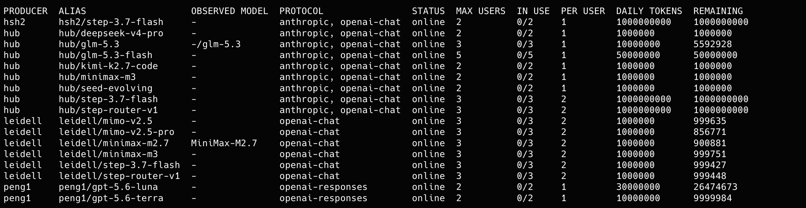

# aweshare 更新：看得见的共享 —— 用量、模型、诚实度，一条命令看清


共享刚上线时，大家问的是「这样共享安不安全」；跑了一周，群里问的就成了另一类：

- 「这个模型现在有人用着吗？我今天还能用多少？」
- 「谁在用我共享的模型？用了多少？」
- 「hub 上现在都有什么可用的？」
- 「这个 alias 说是 qwen，背后真跑的是 qwen 吗？」

这些问题以前要么答不上来，要么得登服务器翻日志。这次更新把它们都变成一条命令的事——给共享装上仪表盘。

GitHub：[github.com/wehuman01/aweshare](https://github.com/wehuman01/aweshare)

## 消费者：选模型看数据，不靠猜

以前消费者面对一串模型名，只能瞎猜：在不在线？挤不挤？今天还有没有额度？现在一条命令全看到：

```bash
aweshare consumer list --hub https://your-hub.example --token asc_...
```

输出大致长这样（示例数据已替换为虚构名称）：

```text
PRODUCER  ALIAS                 OBSERVED MODEL     PROTOCOL                STATUS  MAX USERS  IN USE  PER USER  DAILY TOKENS  REMAINING
alice     alice/step-3.7-flash  -                  anthropic, openai-chat  online  2          0/2     1         1000000000    1000000000
bob       bob/glm-5.3           -/glm-5.3          anthropic, openai-chat  online  3          0/3     1         10000000      5592928
bob       bob/minimax-m3        minimax-m2.7 ✗     openai-chat             online  3          0/3     2         1000000       999751
carol     carol/kimi-k2.7-code  -                  anthropic, openai-chat  online  2          0/2     1         1000000       900881
carol     carol/gpt-5.6-luna    gpt-5.6-luna       openai-responses        online  2          1/2     1         30000000      26459988
hub       hub/deepseek-v4-pro   -/deepseek-v4-pro  anthropic, openai-chat  online  2          0/2     1         1000000       981936
hub       hub/seed-evolving     -                  anthropic, openai-chat  online  5          0/5     1         50000000      50000000
```

表格里每一列，都对应一个你实际会问的问题：

- **STATUS** —— 在线、降级还是已下架。离线的模型默认直接隐藏（反正也调不通），想看全貌加 `--all`。
- **IN USE `n/max`** —— 这个通道此刻有几个人在用。`2/3` 说明还有一个空位；满了就是满了，`3/3` 的新请求会被拒之门外。挑个不挤的用。
- **REMAINING** —— 这个模型今天还剩多少 token 额度。用完了别硬试，明早再来。
- **PROTOCOL** —— `openai-chat` 还是 `openai-responses`。这列解决一个高频踩坑：chat-completions 系的工具和 Codex 式 responses 系的工具，接的端点不一样。看一眼就知道你的工具接不接得上，不用等报错了再回头猜。

顺带一提，示例里 `bob/minimax-m3` 那行的 OBSERVED MODEL 标了 `✗`——声明的名字和上游实际跑的对不上，后面「诚实度」一节细说。

## 生产者：你在 hub 上有一排自己的货架

以前生产者是两眼一抹黑：配置写完、隧道连上，hub 上到底挂没挂上你的模型，只能等消费者反馈才知道。现在：

```bash
aweshare producer list
```

输出大致长这样（以生产者 bob 为例）：

```text
instance: background running (pid 48213, up 2h)

ALIAS           OBSERVED MODEL  PROTOCOL                STATUS  MAX USERS  IN USE  PER USER  DAILY TOKENS  REMAINING
bob/glm-5.3     -/glm-5.3       anthropic, openai-chat  online  3          0/3     1         10000000      5592928
bob/minimax-m3  minimax-m2.7 ✗  openai-chat             online  3          0/3     2         1000000       999751

2 of 2 config offering(s) registered
```

hub 上你名下实际注册了什么、每个 alias 的实时状态和占用、和本地 `config.toml` 有没有出入，一目了然。本地配了但 hub 没收下的 alias（比如重名）会直接写明原因，不用自己去翻 `producer.log`。

想知道谁在用你的模型：

```bash
aweshare producer usage
```

输出大致长这样：

```text
CONSUMER  ALIAS           REQUESTS  ERRORS  RATE    PROMPT  COMPL  UNK  AVG TOOK  LAST USED
dave      bob/glm-5.3     42        0       100.0%  18320   9402   0    1240ms    2026-08-29 14:32Z
erin      bob/glm-5.3     15        0       100.0%  6042    3100   0    1100ms    2026-08-28 21:47Z
dave      bob/minimax-m3  7         1       85.7%   3211    1400   0    980ms     2026-08-29 12:05Z
```

默认就是汇总视图：每个消费者一行，谁用得最多排最前，请求数、错误率、token 合计都在。想看逐笔明细，`--details`。不用再登到 hub 机器上请运营者代查了。

顺手还有个发现入口：`producer list --all` 能以生产者身份浏览整个 hub 的目录——消费者能看到什么，你也能看到什么。

## hub 运营者：电表和名册，一处看全

运营者每天关心的也就这几件事：整体余量怎么样？谁在超量用？哪个模型今天被薅得最狠？

```bash
aweshare hub status
```

输出大致长这样：

```text
hub status
  producer slots: 3/10 active (0 suspended)
  consumers: 5 active (0 suspended)
  offerings: 7 online, 0 offline, 0 degraded, 0 blocked (7 alias(es))
  last 5m: 23 requests, 100.0% ok, 0 error(s)
  consumer defaults: rps 5, burst 10, max concurrent 2
  timeouts: head 120000ms, idle 300000ms

aliases (worst status first):
PRODUCER  ALIAS                 OBSERVED MODEL     PROTOCOL                STATUS  MAX USERS  IN USE  PER USER  DAILY TOKENS  REMAINING
alice     alice/step-3.7-flash  -                  anthropic, openai-chat  online  2          0/2     1         1000000000    1000000000
bob       bob/glm-5.3           -/glm-5.3          anthropic, openai-chat  online  3          0/3     1         10000000      5592928
bob       bob/minimax-m3        minimax-m2.7 ✗     openai-chat             online  3          0/3     2         1000000       999751
carol     carol/kimi-k2.7-code  -                  anthropic, openai-chat  online  2          0/2     1         1000000       900881
carol     carol/gpt-5.6-luna    gpt-5.6-luna       openai-responses        online  2          1/2     1         30000000      26459988
hub       hub/deepseek-v4-pro   -/deepseek-v4-pro  anthropic, openai-chat  online  2          0/2     1         1000000       981936
hub       hub/seed-evolving     -                  anthropic, openai-chat  online  5          0/5     1         50000000      50000000
```

默认是紧凑摘要：按去重后的 alias 逐一列出协议、实时占用（`IN USE n/max`）、今日剩余 token，外加最近 5 分钟的请求量和成功率；生产者、消费者名册只给总数，`--all` 展开完整名单（谁在线、上次活跃是什么时候）。终端里敲一下，hub 的全貌就有了。

查账用：

```bash
aweshare hub usage
```

输出大致长这样：

```text
PRODUCER  CONSUMER  ALIAS                 REQUESTS  ERRORS  RATE    PROMPT  COMPL  UNK  AVG TOOK  LAST USED
bob       dave      bob/glm-5.3           42        0       100.0%  18320   9402   0    1240ms    2026-08-29 14:32Z
carol     erin      carol/gpt-5.6-luna    31        0       100.0%  24150   11088  0    2010ms    2026-08-29 14:10Z
carol     frank     carol/kimi-k2.7-code  19        1       94.7%   9800    5230   0    870ms     2026-08-29 10:22Z
bob       erin      bob/glm-5.3           15        0       100.0%  6042    3100   0    1100ms    2026-08-28 21:47Z
hub       dave      hub/deepseek-v4-pro   12        0       100.0%  4100    2600   0    1530ms    2026-08-28 18:03Z
```

默认看最近 7 天，按「生产者 × 消费者」汇总，最忙的排最前；`--group-by alias` 换成按模型统计，`--details` 看逐笔请求。该给谁限流、哪个 alias 该放宽额度，让数据说话。

## 诚实度：名字对不对得上，hub 现在会记账

这是这次更新里我们最在意的能力。目录里写的是「老王/qwen」，可背后上游实际吐回来的是什么模型——以前 hub 不知道，也没处问。

现在 hub 会把每次响应里上游**自报的模型名**（`observed_model`）记下来，和生产者声明的模型逐 alias 比对，在 `hub status`、`producer list`、`consumer list` 里都多出一列 **OBSERVED MODEL**：对得上就是原名；对不上就标出实际观测到的值；上游不回自报字段、证据不足时，显示 `?`。不评判、不说教，把事实摆出来就行。

发现名不副实，随时可以动手术刀：

```bash
aweshare hub offering block ns/model    # 只封这一个 alias，其余照常服务
aweshare hub offering restore ns/model  # 恢复
```

被封的 alias 对新请求直接回一个明确的 503，生产者的其他模型不受牵连。也可以设一个环境变量让 hub 自动处理：模型连续对不上号时自动下架该 offering（默认只记录、不处理）。

## 一张速查表

| 你想问 | 跑哪条命令 |
|---|---|
| 现在有什么模型能用？还剩多少额度？ | `aweshare consumer list` |
| 这个模型我的工具接得上吗？ | 看 `PROTOCOL` 列（`openai-chat` / `openai-responses`） |
| hub 上我名下挂了什么？和配置一致吗？ | `aweshare producer list` |
| 谁在用我的模型？ | `aweshare producer usage` |
| hub 全貌：占用、余量、5 分钟健康度 | `aweshare hub status` |
| 谁用得最多？哪个模型最忙？ | `aweshare hub usage` |
| 这个 alias 背后真的在跑声明的模型吗？ | 看 `OBSERVED MODEL` 列 |
| 发现名不副实，只封这一个 alias | `aweshare hub offering block <alias>` |

一句话总结：共享这件事，从「相信大家都会守规矩」变成「事实摆在明处，人人看得见」——消费者看得到余量和协议，生产者看得到自己的货架和用户，运营者看得到总账，hub 看得到每个模型的真实名字。

## 试试

### 让 AI agent 帮你装

在 Claude Code、Codex 或任何编程 agent 里说一句：

```text
阅读 https://github.com/wehuman01/aweshare/blob/main/README.ai.md 并按它安装和配置 aweshare。
```

### 或者自己动手

```bash
npm install -g aweshare   # 老用户直接升级即可

# 消费者：看看现在有什么可用
aweshare consumer list --hub https://your-hub.example --token asc_...

# 生产者：查查自己的货架和账单
aweshare producer list && aweshare producer usage

# 运营者：一眼看清 hub
aweshare hub status
```

共享不用再靠默契。谁用了多少、还剩多少、背后是不是真的那个模型——一条命令，全部看得见。

## 现在就申请

消费者 10 个名额，先到先得；生产者不设限，随时欢迎。

发邮件到 [peng@wehuman.top](mailto:peng@wehuman.top)，说明你是谁、想共享还是使用，以及准备接入什么后端。aweshare 本身的 bug 请提交至 [GitHub issues](https://github.com/wehuman01/aweshare/issues)。



现在支持的模型越来越多了。

## More from mugpeng

aweshare 是 aweteam 生态的一部分：

- **[aweskill](https://aweskill.webioinfo.top/)** — CLI 优先的技能包管理器，支持 47+ AI 编程 agent
- **[aweswitch](https://github.com/Webioinfo01/aweswitch)** — Claude Code、Codex、OpenCode 的 agent 配置切换器
- **[awerouter](https://github.com/mugpeng/awerouter)** — 智能路由器，用结构信号把请求分给 Flash 或 Pro 模型，减少不必要的模型开销
- **[aweshelf](https://github.com/Webioinfo01/aweshelf)** — 收藏、分类、恢复 AI 编程会话，还能搭配aweswitch 实现保存配置，一键启动
- **[aweshare](https://github.com/wehuman01/aweshare)** — 通过自建 Hub 共享本地 Ollama/vLLM 或已授权的 OpenAI/Anthropic 后端，实现token 的共享经济
- **[awewarm](https://github.com/wehuman01/awewarm)** — 订阅窗口保持器，让 AI 编程套餐的窗口持续激活，无论是本地设置，还是通过远程连接的服务器
